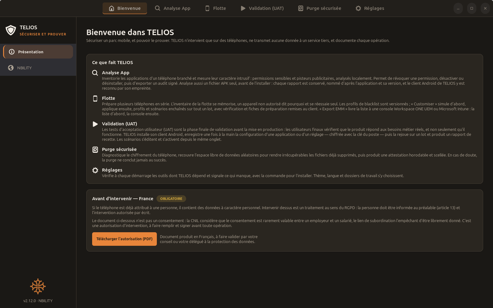
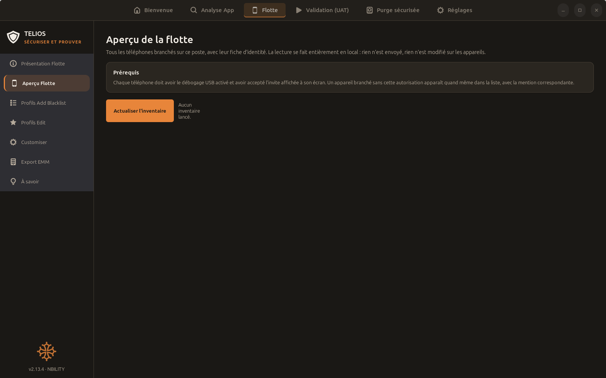
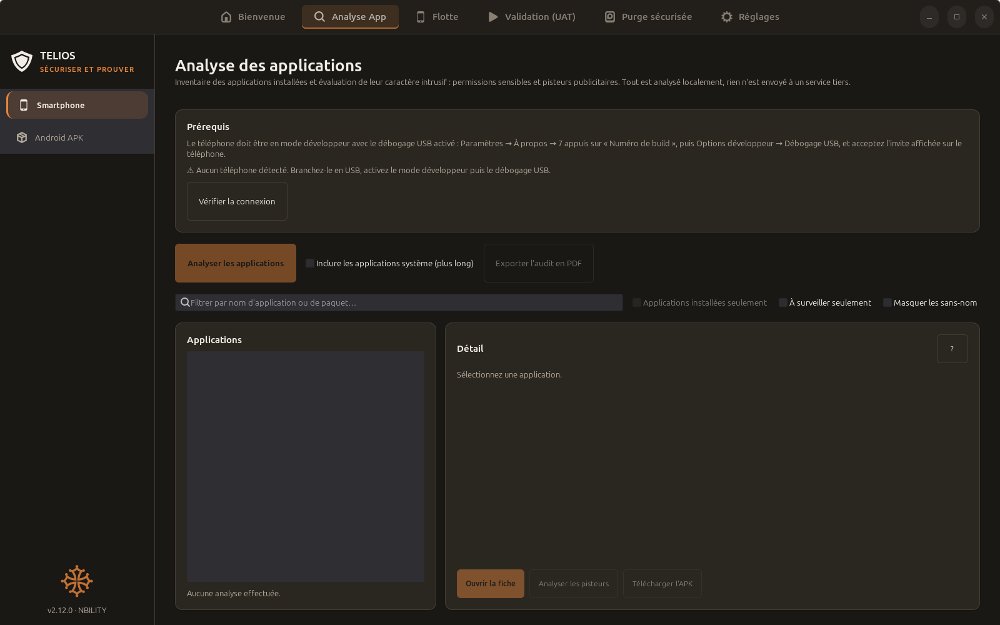

# TELIOS — sécuriser un parc mobile, et pouvoir le prouver

TELIOS est l'outil de NBILITY pour auditer, préparer et assainir des
smartphones Android depuis un poste Linux Mint ou Ubuntu. Il s'adresse aux
DSI, aux prestataires informatiques et aux reconditionneurs qui gèrent une
flotte de téléphones et doivent **démontrer** ce qui a été fait sur chacun.

Trois engagements, tenus par conception :

- **Rien ne quitte le poste.** Toute analyse est locale ; aucune donnée d'un
  téléphone n'est transmise à un service tiers.
- **Chaque opération laisse une trace.** Audits, fiches de préparation,
  rapports de recette et attestations d'effacement sont datés, scellés par une
  empreinte SHA-256 et remis au client en PDF.
- **En cas de doute, jamais de succès.** Une opération qui n'a pas pu être
  vérifiée est rapportée comme telle, à l'écran et dans le document.

## Ce que fait TELIOS

| Onglet | Rôle |
|---|---|
| **Analyse App** | Inventorier les applications d'un téléphone et mesurer leur caractère intrusif — permissions sensibles, pisteurs publicitaires — puis révoquer, désactiver, désinstaller et exporter un audit signé. Analyse aussi un fichier APK seul, avant installation. |
| **Flotte** | Préparer plusieurs téléphones en série : inventaire mémorisé, profils de liste noire versionnés, application simulée puis réelle sur tout un lot, fiches de préparation. Export de la liste vers une console **Workspace ONE UEM** ou **Microsoft Intune**. |
| **Validation (UAT)** | Enregistrer une fois à la main la configuration d'une application ou d'un réglage Android, chiffrée sur le poste, puis la rejouer sur un lot et produire un rapport de recette. |
| **Purge sécurisée** | Diagnostiquer le chiffrement, recouvrir l'espace libre pour rendre irrécupérables les fichiers supprimés, et délivrer une attestation horodatée et scellée. Effacement cryptographique et TRIM, jamais de passes multiples inopérantes sur mémoire flash. |
| **Réglages** | Vérifier à chaque démarrage les outils requis, choisir thème, langue et dossiers. Interface en français, anglais et espagnol. |

Avant toute intervention sur un téléphone déjà attribué, TELIOS rappelle
l'obligation d'information et d'autorisation écrite prévue par le RGPD, et
produit le formulaire correspondant.

## Ce dont vous avez besoin

- Linux Mint 21 ou plus, ou Ubuntu 22.04 ou plus, avec Python 3.8 ou plus.
- Un câble USB et le débogage USB activé sur les téléphones.
- Les paquets `python3-gi`, `gir1.2-gtk-4.0`, `python3-gi-cairo` et `adb` —
  l'installateur les propose s'ils manquent. `scrcpy` et `openssl` sont
  facultatifs.

Aucune autre dépendance : TELIOS n'utilise que la bibliothèque standard de
Python et GTK 4.

## Installer TELIOS

```bash
wget -O install.sh https://github.com/NBILITY-HOME/TELIOS_RELEASES/raw/main/install.sh
bash install.sh
```

À lancer en simple utilisateur, jamais avec `sudo`. L'installateur télécharge
la dernière version publiée, en vérifie la signature et l'empreinte, pose le
lanceur et l'entrée de menu. Aucune clé à saisir.
Les mises à jour suivantes se font depuis l'application, sans clé et sans
terminal : chaque version s'installe dans son propre dossier, l'archive est
vérifiée par son empreinte avant extraction, et revenir à la précédente est
immédiat.

## Ce dépôt

Il ne contient **aucun code source**, qui reste privé. On y trouve :

- `install.sh` — l'installateur, à télécharger pour une première pose ;
- `latest.json` — version courante, adresse de l'archive et empreinte SHA-256,
  que les postes interrogent pour se mettre à jour ;
- *Releases* — les archives publiées, une par version.

## Un aperçu







## Contact

Édité par NBILITY — <https://nbility.fr/> — <contact@nbility.fr>
