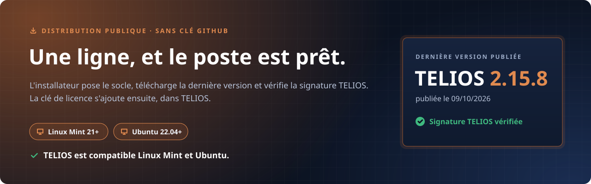

<p align="center">
  
</p>

# TELIOS — sécuriser un parc mobile, et pouvoir le prouver

**Dernière version : TELIOS 2.15.8, publiée le 09/10/2026** — signature TELIOS vérifiée ·
[notes de version](https://github.com/NBILITY-HOME/TELIOS_RELEASES/releases/tag/v2.15.8)

TELIOS est l'outil de NBILITY pour auditer, préparer et assainir des
smartphones Android depuis un poste Linux Mint ou Ubuntu. Il s'adresse aux
DSI, aux prestataires informatiques et aux reconditionneurs qui gèrent une
flotte de téléphones et doivent **démontrer** ce qui a été fait sur chacun.

## Trois engagements, tenus par conception

- **Rien ne quitte le poste.** Toute analyse est locale ; aucune donnée d'un
  téléphone n'est transmise à un service tiers.
- **Chaque opération laisse une trace.** Audits, fiches de préparation,
  rapports de recette et attestations d'effacement sont datés, scellés par une
  empreinte SHA-256 et remis au client en PDF.
- **En cas de doute, jamais de succès.** Une opération qui n'a pas pu être
  vérifiée est rapportée comme telle, à l'écran et dans le document.

## Ce que fait TELIOS

| Onglet | Rôle |
|---|---|
| **Analyse App** | Inventorier les applications d'un téléphone et mesurer leur caractère intrusif — permissions sensibles, pisteurs publicitaires — puis révoquer, désactiver, désinstaller et exporter un audit signé. Analyse aussi un fichier APK seul, avant installation. |
| **Flotte** | Préparer plusieurs téléphones en série : inventaire mémorisé, profils de liste noire versionnés, application simulée puis réelle sur tout un lot, fiches de préparation. Export de la liste vers une console **Workspace ONE UEM** ou **Microsoft Intune**. |
| **Validation (UAT)** | Enregistrer une fois à la main la configuration d'une application ou d'un réglage Android, chiffrée sur le poste, puis la rejouer sur un lot et produire un rapport de recette. |
| **Purge sécurisée** | Diagnostiquer le chiffrement, recouvrir l'espace libre pour rendre irrécupérables les fichiers supprimés, et délivrer une attestation horodatée et scellée. Effacement cryptographique et TRIM, jamais de passes multiples inopérantes sur mémoire flash. |
| **Réglages** | Vérifier à chaque démarrage les outils requis, choisir thème, langue et dossiers. Interface en français, anglais et espagnol. |

Avant toute intervention sur un téléphone déjà attribué, TELIOS rappelle
l'obligation d'information et d'autorisation écrite prévue par le RGPD, et
produit le formulaire correspondant.

## Installer TELIOS

Une seule ligne, à coller dans un terminal (menu → Terminal, ou Ctrl+Alt+T),
**sans sudo** :

```bash
wget -O install.sh https://raw.githubusercontent.com/NBILITY-HOME/TELIOS_RELEASES/main/install.sh && bash install.sh
```

<p align="center">
  
</p>

<details>
<summary>Les six étapes, en texte</summary>

1. **Préparer le poste**
   - Un PC sous **Linux Mint 21+ ou Ubuntu 22.04+**.
   - Une connexion Internet.
   - Un compte utilisateur normal, **jamais root**.
   - La **clé de licence** de votre entreprise (TLK-XXXXX-XXXXX-XXXXX-XXXXX-XXXXX), visible dans l'espace client, page Postes.
2. **Lancer l'installation**
   Ouvrez un terminal (menu → Terminal, ou Ctrl+Alt+T), puis collez cette ligne, **sans sudo** :

   ```bash
   wget -O install.sh https://raw.githubusercontent.com/NBILITY-HOME/TELIOS_RELEASES/main/install.sh && bash install.sh
   ```
3. **Laisser faire l'installateur**
   - Il vérifie le socle (Python 3.8+, PyGObject, GTK 4) et propose de l'installer s'il manque ; le mot de passe est demandé une seule fois.
   - Il télécharge la dernière version publiée et vérifie la signature TELIOS.
   - Il pose l'icône dans le menu (rubrique Accessoires).
   **Aucune clé n'est demandée à l'installation.**
4. **Activer le poste**
   Ouvrez TELIOS depuis le menu, allez dans Réglages → Licence, collez la clé de licence (ou scannez son QR code), puis cliquez « Activer ce poste ».
5. **Compléter les outils**
   Les autres outils (ADB, rapports PDF, lecture de QR code, etc.) s'installent depuis TELIOS, dans Réglages → Dépendances : les manquants y sont pré-cochés.
6. **Rester à jour**
   Les mises à jour sont proposées au lancement de TELIOS, et s'installent depuis Réglages → Mises à jour.

</details>

**TELIOS est compatible Linux Mint et Ubuntu.**

## Ce dépôt

Il ne contient **aucun code source**, qui reste privé. On y trouve :

- `install.sh` — l'installateur, à télécharger pour une première pose ;
- `latest.json` — version courante, adresse de l'archive, empreinte SHA-256 et
  signature, que les postes interrogent pour se mettre à jour ;
- *Releases* — les archives publiées, une par version.

Ce README, sa bannière et ses six étapes sont régénérés à chaque version
publiée, à partir du manifeste signé.

## Un aperçu


## Contact

Édité par NBILITY — <https://nbility.fr/> — <contact@nbility.fr>
